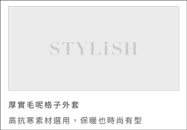
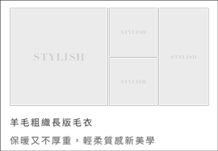

# Week 0 Part 1

## Before assignment

We are going to make our first page of STYLiSH. Here's the link of UI design:

[Home Page](https://zpl.io/bPXN91p)

## Assignment

We build the UI portion of this page first.

1. Establish a `RecyclerView` by `ListAdapter` with 3 different `ViewHolders` (header and 2 different cells).

  
  -
  
  -
  
  -

 **Make sure I can see these different cells on the app screen.**

2. Establish `Toolbar` in activity not fragment, each page has the same toolbar.

3. Establish `BottomNavigation` with `Jetpack Navigation` design.

4. You should use `noto_sans` (find it from fontFamily of Android Studio) instead of `NotoSansCJKtc` series as font in STYLiSH.

**Make sure your app fit the UI designs in Zeplin. You should take care of the colors, font, distance, etc...**

**You can find images and icon in `resources` folder under this repo.**

**Your app should work perfectly in all Android devices.**

## Hint

1. Toolbar
2. App Navigation
3. [Add a List Header from Lesson 7: RecyclerView of Developing Android Apps with Kotlin on Udacity](https://classroom.udacity.com/courses/ud9012/lessons/ee5a525f-0ba3-4d25-ba29-1fa1d6c567b8/concepts/f6f93918-d9a6-4dc7-a44e-d10532325516)

## Note

1. You don't need to implement DrawerLayout, just place the icon on the upper left.
2. In this part, you don't have to set the cart quantity view yet.

