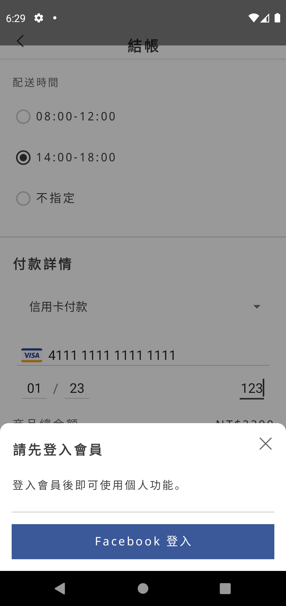

# Week 3 Part 2

## Assignment

1. Establish following pages:
    - [Checkout Success Page](https://zpl.io/am99qpA)

2. Establish user checkout flow with [Check Out API](https://github.com/AppWorks-School/API-Doc/tree/master/Stylish#order-check-out-api).

3. If user didn't login, popup the Login Page.

